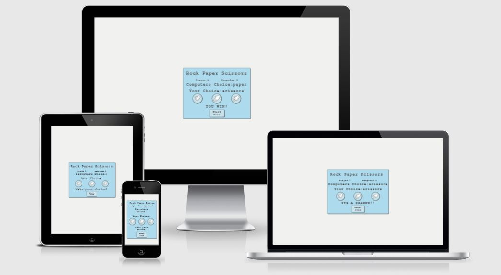

# Rock Paper Scissors

A classic two-person game. 
Players start each round by saying, “rock, paper, scissors, shoot!”
On “shoot,” each player holds out their fist for rock, flat hand for paper, or their index and middle finger for scissors.
Rock crushes scissors, scissors cut paper, and paper covers rock. See who wins each round!

Im resposive image

The live link can be found here -

# Index
*
*
*
*
# User Experience (UX)
## User stories
*
*
*
# Design
*
*
*
*
## Wireframes
*
*
*
*
# Features
*
*
*
# Technologies Used
*
*
*
# Testing
*
*
*
# Testing User Stories from User Experience (UX) Section
*
*
*
# Deployment
*
*
*
# Credits
