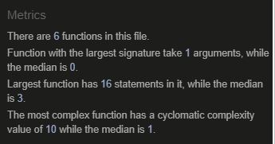

# Rock Paper Scissors 

A classic two-person game. 
Players start each round by saying, “rock, paper, scissors, shoot!”
On “shoot,” each player holds out their fist for rock, flat hand for paper, or their index and middle finger for scissors.
Rock crushes scissors, scissors cut paper, and paper covers rock. See who wins each round!

The live link can be found here - [Rock Paper Scissors](https://aleksandrdenis.github.io/RockPaperScissors/)

# Index
* [UX](User Experience (UX)
* [Design] (# Design)
* [Technologies Used] (# Technologies Used)
* [Testing] (# Testing)
* [Deployment] (# Deployment)
* [Credits] (# Credits)
# User Experience (UX)
### User stories
#### First Time Visitor Goals
  1. As a First Time Visitor, I want to easily understand the main purpose of the site.
  2. As a First Time Visitor, I want chalge computer in the game.
  3. As a first Time Visitor, I want have fun.
  
#### Returning Visitor Goals
  1. As a Returning Visitor, I want to chalge computer over agin.
  2.  As a Returning Visitor, I want to have more fun.
  
####  Frequent User Goals
  1. As a Frequent User, I want to see how may time i can win agaist computer.
  2. As a Frequent User, I want to have more fun.
  
# Design
#### Colour Scheme
* The two main colours used are rgb(70, 68, 68) and rgba(135, 207, 235, 0.63).

#### Typography
* I used Courier New monospace font as typical fixed pitch design, monotone in weigh to imetate classic typewriter output.

#### Imagery
* Image are very simple to represent rock paper and scissors.
#### Wireframes
 
#### Features
* Resposive on mobile divices
* Interactive
# Technologies Used
#### Languages Used
* [HTML5](https://en.wikipedia.org/wiki/HTML5)
* [CSS3](https://en.wikipedia.org/wiki/Cascading_Style_Sheets)
* [JavaScript](https://en.wikipedia.org/wiki/JavaScript)
#### Programs Used
* [GitHub:](https://github.com/)
  * GitHub is used to store the projects code.
*  [Photoshop:](https://www.adobe.com/ie/products/photoshop.html)
  * Photoshop was used to resize images and for editing images for the website.
* [Balsamiq:](https://balsamiq.com/)
  * Balsamiq was used to create the wireframe design.
# Testing
### Validator and Testing
* Accessibility
   * I confirmed that website preforms highly, running through Chrome's lighthouse devtools. Colors and fonts chosen easy to read.
 

* HTML
   * No errors were returned when passing the official [W3C](https://validator.w3.org/) validator.
   
   
* CSS
   * No errors were found when passing through the official [Jigsaw](https://jigsaw.w3.org/css-validator/) validator.

* Javascript
  * No errors but warnings were returned when passing through the the [JSHint](https://jshint.com/) Validator.
  

* Game Testing
  * All buttons were tested manually to ensure the user is choice is confirmd when presed.
  * Computer choice where tested for random selection
  * Score incresment work acordenly to outcome of the game.
  * Outcome message displayed correctly depending on the winner.
# Known Bugs
* There are no known bugs.
# Fixed Bugs
* The game would not work after testing descoverd syntax errors.
# Deployment
* The site was deployed to GitHub pages. The steps to deploy are as follows:
   * In GitHub repository, navigate to the settings tab.
   * From side menu select pages tab.
   * Once there select source branch:main, select folder/(root).
   * Click save, the page provided the link to the completed website.
   
The live link can be found here - [Rock Paper Scissors](https://aleksandrdenis.github.io/RockPaperScissors/)
# Credits
#### Code
* To  Center and align content on page code from [developer](https://developer.mozilla.org/en-US/).
* Typing effect code from  [Dev](https://dev.to/j471n/typing-effect-by-using-css-50p).
* To get random choice for computer from [developer](https://developer.mozilla.org/en-US/docs/Web/JavaScript/Reference/Global_Objects/Math/random)
* Function  to pick wiiner code from [stackoverflow](https://stackoverflow.com/questions/66247447/need-help-for-solving-switch-case-statement-for-rock-paper-scissors)
#### Media
* Images for the websites were taken from [pngtree](https://pngtree.com/free-png).
* Audio from [zapsplat](https://www.zapsplat.com/).
#### Books
* Javascript & jquery by Jon Duckett.
### [Go To Top](#top)

