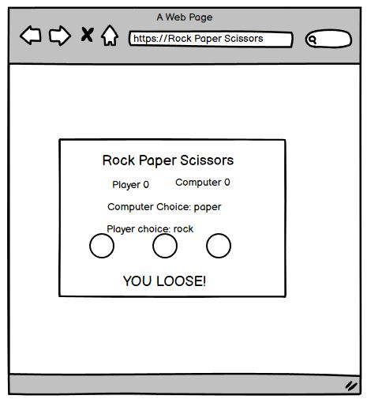

# Rock Paper Scissors

A classic two-person game. 
Players start each round by saying, “rock, paper, scissors, shoot!”
On “shoot,” each player holds out their fist for rock, flat hand for paper, or their index and middle finger for scissors.
Rock crushes scissors, scissors cut paper, and paper covers rock. See who wins each round!

The live link can be found here - [Rock Paper Scissors](https://aleksandrdenis.github.io/RockPaperScissors/)

# Index
*
*
*
*
# User Experience (UX)
### User stories
#### First Time Visitor Goals
  1. As a First Time Visitor, I want to easily understand the main purpose of the site.
  2. As a First Time Visitor, I want chalge computer in the game.
  3. As a first Time Visitor, I want have fun.
  
#### Returning Visitor Goals
  1. As a Returning Visitor, I want to chalge computer over agin.
  2.  As a Returning Visitor, I want to have more fun.
  
####  Frequent User Goals
  1. As a Frequent User, I want to see how may time i can win agaist computer.
  2. As a Frequent User, I want to have more fun.
  
# Design
#### Colour Scheme
* The two main colours used are rgb(70, 68, 68) and rgba(135, 207, 235, 0.63).

#### Typography
* I used Courier New monospace font as typical fixed pitch design, monotone in weigh to imetate classic typewriter output.

#### Imagery
* Image are very simple to represent rock paper and scissors.
#### Wireframes
 

 
*
*
*
*
## Wireframes
*
*
*
*
# Features
*
*
*
# Technologies Used
*
*
*
# Testing
*
*
*
# Testing User Stories from User Experience (UX) Section
*
*
*
# Deployment
*
*
*
# Credits
